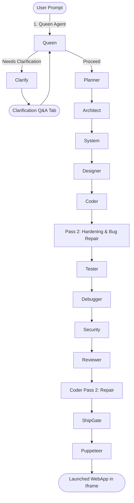

# Software Requirements Specification (SRS) & System Architecture Reference
**Project Name:** Autocoder
**Version:** 2.0 (RuFlo-Native Multi-Agent Pipeline, VAPT Hardened, Specification-Memory Architecture)
**Author:** AI Systems Architect
**Last Updated:** July 8, 2026
**Supersedes:** SRS v1.0 (July 7, 2026) + Architecture Improvements Addendum

---

## Revision Note

This version consolidates the original Autocoder SRS (v1.0) with the Architecture
Improvements Addendum into a single authoritative specification. The Specification
Memory Layer (SML), persistent knowledge store, agent retrieval tools, dependency
manifest, and related orchestration upgrades are now first-class parts of the
system architecture (Sections 5–9) rather than a separate document. No content
from either source has been removed; overlapping material has been merged and
renumbered for coherence.

---

## Table of Contents

1. Executive Summary & System Overview
2. Frontend Subsystems Architecture
3. Backend Architecture & Engine Inventory
4. RuFlo Multi-Agent Specification Compiler
5. Specification Memory Layer (SML)
6. Persistent Data Architecture
7. Agent Retrieval Tool Layer
8. Dependency Manifest & Context Builder
9. Orchestrator & Execution Lifecycle
10. Model Inference Strategy
11. Non-Functional Requirements
12. Agent Contracts
13. Failure Handling
14. Reviewer Metrics
15. Security Requirements
16. Telemetry Requirements
17. Plugin Architecture
18. Expected Benefits
19. Appendix: Glossary

---

## 1. Executive Summary & System Overview

**Autocoder** is a local-first, multi-agent code compilation platform designed to
synthesize, validate, repair, and optimize full-stack web applications from
natural language prompts. Operating on the **Spiral SDLC Model**, Autocoder moves
away from standard templates and code-completion shortcuts. Instead, it uses a
formal multi-pass pipeline of specialized agents that function as a software
assembly line, with every intermediate output persisted, versioned, and
retrievable as structured data rather than passed around as raw context.



---

## 2. Frontend Subsystems Architecture

The frontend represents a developer workspace, implementing an IDE clone,
telemetry dashboards, security consoles, and model tuning interfaces.

### 2.1 Component & Page Breakdown

#### 2.1.1 Landing Dashboard
- **Purpose**: Application portal offering quick-start templates, workspace
  history, and system initialization toggles.
- **Key Capabilities**:
  - Displays recent active conversations, including project domain and status.
  - Lists quick-start blueprints (e.g., E-commerce store, Kanban board, Fitness
    tracker) that preload structured prompts.
  - Direct links to telemetry dashboards: System Health, Tool Logger, VAPT, and
    SLM Settings.

#### 2.1.2 Interactive Workspace
- **Purpose**: The primary project development interface, guiding users from
  initial prompt, through the Plan Approval Gate, into live coding and
  telemetry.
- **Key Capabilities**:
  - **Split-Pane Layout**: interactive chat window on the left; multi-tab panel
    on the right displaying generated project assets in real time.
  - **Telemetry Accordion**: streams backend agent activity via Server-Sent
    Events (SSE) — active agents, processing steps, elapsed time, and logging.
  - **Approval Gate**: renders the generated blueprint prior to writing files.
    Users review proposed database entities, page layouts, and integrations,
    then reject with feedback or click **Approve & Generate**.
  - **Tabs Container**:
    - **Code**: full file explorer and code editor (Monaco Editor or custom
      styling) with inline diffing for surgical edits.
    - **Live Preview**: mounts a live rendering of the compiled webapp (see
      Live Code Runner below).
    - **Flowchart**: interactive Mermaid diagrams showing entity relationships,
      data flow, and workflow states.
    - **Git Diff**: displays file mutations between compilation passes.
    - **Telemetry Logs**: raw streams of LLM prompts and responses.

#### 2.1.3 Live Code Runner
- **Purpose**: Dynamically renders the generated application.
- **Behavior**: If WebContainer headers (COOP/COEP) are not available, the
  runner transpiles TSX/JSX/JS client-side via Babel, bundles it with custom
  CSS, and renders it in an isolated sandbox with a mocked router. Where a full
  execution environment is required, code is run in a VS Code-backed runtime,
  executed remotely, and the resulting output is captured and displayed via
  Puppeteer.

#### 2.1.4 Tool Execution Logger
- **Purpose**: Real-time audit log of all backend agent commands, tool calls,
  and API integrations.
- **Key Capabilities**:
  - Interactive charts for tool execution frequency, system latency, and agent
    token usage.
  - Searchable logs filterable by agent name, outcome (Success/Error), and
    execution time.
  - Inspection of prompt histories, raw LLM payloads, and schema validations.
  - Comprehensive logging of all backend and frontend events.

#### 2.1.5 System Health Monitor
- **Purpose**: Displays status of local and remote infrastructure powering
  Autocoder.
- **Key Capabilities**:
  - Live CPU and memory load charts.
  - Connection status for local model runners (Ollama, GGUF providers) and
    cloud services.
  - Latency scorecards for active models.
  - Customizable alert thresholds.

#### 2.1.6 SLM Model Settings
- **Purpose**: Control center for model routing and prompt template weights.
- **Key Capabilities**:
  - **Model Configuration**: connect LLMs via API or Ollama.
  - **Prompt Temperature Controls**: tune LLM hyperparameters per agent.

---

## 3. Backend Architecture & Engine Inventory

The backend is built with Express and TypeScript. Rather than exposing standard
CRUD endpoints, it coordinates agent tasks, executes local code transpilation,
runs tests, and hosts MCP tool specifications.

### 3.1 Key Engine Modules

#### 3.1.1 Adaptive Clarification Engine
- **Purpose**: If prompt ambiguity exceeds a `0.7` threshold, suspends
  execution before planning begins.
- **Capabilities**:
  - Generates 3 contextual multiple-choice questions to resolve scope gaps.
  - Calculates a "Readiness Score" indicating whether there is enough detail to
    construct a coherent project plan.

#### 3.1.2 Targeted Code Editor
- **Purpose**: Applies code patches without rewriting entire files.
- **Capabilities**:
  - Accepts surgical diff inputs (Search & Replace blocks) and applies them
    with regex and AST safety checks.

#### 3.1.3 Specification Memory Subsystem
- **Purpose**: Backend services that implement the Specification Memory Layer
  (Section 5) — validation, repair, storage, indexing, and retrieval of every
  agent's JSON output. Detailed in Sections 5–9.

---

## 4. RuFlo Multi-Agent Specification Compiler

The **RuFlo (Run Flow)** pipeline manages generation across 3 compiler passes
using 10 specialized agent roles.

```
Pass 1: Scaffolding (Queen -> Planner -> Architect -> System -> Designer -> Coder)
               |
               v
Pass 2: Hardening (Tester -> Debugger -> Security -> Reviewer -> Coder Repair -> Ship Gate)
```

### 4.1 Pass-by-Pass Compiler Workflow

1. **Pass 1 — Project Discovery & Planning**
   - **Queen** analyzes user intent, defines the project goal, freezes the MVP
     scope, records assumptions, constraints, and risks, and produces the
     canonical project context.
   - **Capability Resolver** determines the required frontend, backend,
     database, ORM, testing, and deployment technologies from the project
     requirements.
   - **Compatibility Validator** verifies that selected technologies are
     supported by the orchestration environment and rejects incompatible
     combinations before planning begins.
   - **Planner** converts project scope into an implementation plan: tech
     stack, MVP features, functional/non-functional requirements,
     deliverables, and downstream objectives.
   - **Architect** designs project architecture, directory structure, modules,
     shared resources, dependencies, and implementation order.
   - **System** designs the backend: database schemas, APIs, routing,
     middleware, services, validation rules, business rules, and
     configuration.
   - **Designer** defines the UI/UX specification: design philosophy,
     navigation, pages, reusable components, interactions, accessibility, and
     design system.
   - **Coder** implements complete production-ready source code, strictly
     following approved specifications without independent architectural or
     functional decisions.

2. **Pass 2 — Validation & Hardening**
   - **Tester** generates automated unit, integration, API, UI, and end-to-end
     tests, validating that the implementation satisfies approved MVP
     requirements.
   - **Debugger** performs root-cause analysis on failed tests, compiler
     errors, and runtime issues, producing structured implementation
     instructions for the Coder without modifying source code.
   - **Security** performs a static security review — vulnerabilities,
     insecure configurations, missing controls, authN/authZ issues, insecure
     forms, missing headers, exposed secrets, OWASP-aligned findings —
     producing remediation guidance for the Coder.
   - **Reviewer** evaluates overall project quality, specification compliance,
     maintainability, and completeness, determining whether the project meets
     the required quality threshold.

3. **Ship Gate — Final Validation & Packaging**
   - Validates dependency compatibility and runtime support.
   - Verifies project structure and generated artifacts.
   - Executes linting, formatting, compilation, and automated test suites.
   - Ensures security review and quality thresholds are satisfied.
   - Packages the project into the final deliverable for deployment or
     download.

### 4.2 Agent Specifications

| Agent Name | Responsibilities | Target Guidelines |
|------------|------------------|-------------------|
| **Queen** | Understand user intent, define the project goal, MVP scope, assumptions, constraints, and risks. Produce the canonical project context for the pipeline. | Freeze project intent. May set `needsClarification` or `unsupportedRequest` to halt the pipeline before planning begins. |
| **Planner** | Define the implementation plan including MVP features, functional requirements, non-functional requirements, deliverables, and downstream objectives. | Plan **what** should be built without making architectural or implementation decisions. |
| **Architect** | Design the software architecture, project structure, modules, dependencies, shared resources, and implementation order. | Define **how the project is organized** without implementing business logic or source code. |
| **System** | Design the backend including database models, APIs, routing, middleware, services, validation rules, business rules, and configuration. | Define backend behaviour while remaining consistent with the approved architecture and MVP scope. |
| **Designer** | Design the UI/UX, navigation, user flows, page hierarchy, reusable components, accessibility, and design system. | Ensure every approved feature has appropriate UI coverage while following modern UX principles. |
| **Coder** | Generate complete production-ready source code following all upstream specifications. | Implement only what has been approved. Must not introduce new features, redesign architecture, or make independent engineering decisions. |
| **Tester** | Generate automated tests and validate that the implementation satisfies approved MVP requirements. Report reproducible defects. | Produce comprehensive unit, integration, API, UI, and end-to-end tests without modifying application source code. |
| **Debugger** | Perform root-cause analysis of compilation errors, runtime failures, and failed tests. Produce structured implementation instructions for the Coder. | Diagnose issues only. Must not generate or modify source code. |
| **Security** | Perform static security analysis of the generated application to identify vulnerabilities, insecure configurations, missing security controls, and OWASP-related issues. | Produce actionable remediation recommendations without modifying application source code. |
| **Reviewer** | Evaluate overall project quality, completeness, maintainability, standards compliance, and specification adherence. | Determine whether the implementation satisfies the required quality threshold before release. |
| **Ship Gate** | Perform final validation by verifying compilation, dependency compatibility, linting, formatting, automated tests, security findings, and packaging readiness. | Block release if critical validation checks fail; otherwise approve the project for delivery. |

---

## 5. Specification Memory Layer (SML)

### 5.1 Purpose

The SML is a persistent memory layer that stores every validated agent
response as structured JSON, rather than repeatedly passing large JSON objects
through prompts.

### 5.2 Objectives

- Eliminate context bloat
- Support very large projects
- Enable deterministic agent execution
- Provide replayability and auditing
- Reduce token usage
- Improve scalability

### 5.3 Conversation Knowledge Store

Each conversation owns an isolated knowledge store:

```
Conversation
│
├── Queen Output
├── Planner Output
├── Architect Output
├── System Output
├── Designer Output
├── Blueprinter Output
├── Coder Output
├── Tester Output
├── Debugger Output
├── Security Output
├── Reviewer Output
├── Refiner Output
└── Ship Gate Output
```

Agents never receive the complete history directly. Instead, they retrieve
only the data they need through controlled retrieval tools (Section 7).

### 5.4 Versioned Specification Memory

Every stored response contains:

- Conversation ID
- Agent
- Stage
- Pass
- Version
- Timestamp
- Schema Version
- Hash
- Validated JSON

This supports rollback and deterministic replay across the pipeline.

---

## 6. Persistent Data Architecture

### 6.1 `conversations`

| Column | Description |
|---|---|
| conversation_id | Primary Key |
| title | Conversation title |
| status | Active / Completed |
| current_stage | Current compiler stage |
| created_at | Timestamp |
| updated_at | Timestamp |

### 6.2 `agent_outputs`

Stores every validated JSON response.

| Column | Description |
|---|---|
| id | PK |
| conversation_id | FK |
| agent_name | Agent |
| stage | Compiler stage |
| schema_version | Output schema |
| model | Model used |
| validated_json | JSONB |
| execution_time | Runtime |
| token_usage | Tokens |
| attempt | Retry count |
| created_at | Timestamp |

### 6.3 `agent_indexes`

Stores indexed JSON paths, e.g.:

- `Planner.features`
- `Planner.vocabulary`
- `Architect.modules`
- `System.entities`
- `Designer.components`

### 6.4 `execution_history`

Tracks execution lifecycle:

- Start time
- Completion
- Retries
- Latency
- Failures
- Repair attempts

---

## 7. Agent Retrieval Tool Layer

Agents receive tools instead of raw upstream JSON.

### 7.1 `queryAgentOutput()`

Retrieves a specific JSON path.

```ts
queryAgentOutput({
  conversationId,
  agent: "Planner",
  path: "features"
})
```

### 7.2 `queryMultiple()`

Retrieves multiple fields simultaneously.

### 7.3 `searchKnowledge()`

Performs semantic search over stored specifications.

### 7.4 `writeAgentOutput()` Pipeline

1. Validate JSON
2. Repair JSON (if required)
3. Store
4. Index
5. Notify Orchestrator

### 7.5 JSON-Aware Extraction Tools

Instead of parsing large JSON documents, agents receive dedicated retrieval
tools:

- `getFeatures()`
- `getRequirements()`
- `getVocabulary()`
- `getModules()`
- `getPages()`
- `getComponents()`
- `getEntities()`
- `getBusinessRules()`
- `getEndpoints()`
- `getNavigation()`
- `getBlueprint(file)`
- `getSecurityIssues()`
- `getFailures()`
- `getQualityAnnotations()`

---

## 8. Dependency Manifest & Context Builder

### 8.1 Dependency Manifest

Each agent declares exactly which upstream fields it needs:

```yaml
Architect:
  - Planner.features
  - Planner.requirements
  - Queen.constraints

System:
  - Planner.vocabulary
  - Architect.modules

Designer:
  - Planner.features
  - Architect.modules
  - System.entities
```

This prevents unnecessary context injection.

### 8.2 Context Builder

A dedicated Context Builder assembles prompts:

```
Agent Starts
        ↓
Read Dependency Manifest
        ↓
Retrieve Required JSON Paths
        ↓
Merge Context
        ↓
Inject System Prompt
        ↓
Run Model
```

---

## 9. Orchestrator & Execution Lifecycle

### 9.1 Orchestrator Responsibilities

The Orchestrator is responsible for:

- Scheduling agents
- Retry policies
- Context assembly
- Tool injection
- Dependency resolution
- State management
- Failure recovery
- Stage transitions

### 9.2 Agent Execution Lifecycle

```
Run Agent
      ↓
Validate Output
      ↓
Schema Repair
      ↓
Revalidate
      ↓
Persist Output
      ↓
Generate JSON Indexes
      ↓
Update Execution History
      ↓
Release Next Agent
```

---

## 10. Model Inference Strategy

Autocoder optimizes local-first performance. It handles large-context tasks
locally using hardware acceleration, and delegates to remote LLMs only when
needed.

```
Prompt -> Local Ollama Check -> (Available & Responsive?)
                                     |
                                     +--> Yes -> Run Local Inference
                                     |
                                     +--> No (Timeout > 15s) -> Halt / Fallback
```

- **Local Inference Runner**: integrates with local runners via the Ollama
  HTTP API or direct execution of GGUF files using `node-llama-cpp`.

---

## 11. Non-Functional Requirements

Define measurable limits including:

- Maximum supported LOC per project
- Concurrent projects supported
- Response latency targets (per agent and end-to-end)
- Memory limits (per conversation and system-wide)
- Availability targets
- Recovery objectives (RTO/RPO for the persistent data store)

---

## 12. Agent Contracts

Every agent must define:

- Input Contract
- Output Contract
- Required JSON Paths
- Success Criteria
- Failure Conditions
- Retry Policy

---

## 13. Failure Handling

The system must specify defined behavior for:

- Invalid JSON
- Tool failure
- Missing dependencies
- Schema mismatch
- Security failures
- Infinite repair loops
- Model timeout

---

## 14. Reviewer Metrics

The Reviewer agent should evaluate:

- Test Coverage
- Maintainability
- Cyclomatic Complexity
- Accessibility
- Security Score
- Documentation Coverage
- Code Duplication
- Build Success

---

## 15. Security Requirements

The Security agent must additionally validate:

- OWASP Top 10
- Dependency CVEs
- Secrets exposure
- SBOM (Software Bill of Materials)
- License Compliance
- Authentication
- Authorization
- Input Validation
- HTTP Security Headers
- Prompt Injection
- Supply Chain Risks

---

## 16. Telemetry Requirements

Telemetry must include:

- Active Agent
- Stage
- Execution Time
- Token Usage
- Cost
- Retry Count
- Tool Calls
- Model Selection
- Context Size
- Cache Hits
- Validation Status

---

## 17. Plugin Architecture

Support pluggable integrations, including:

- GitHub
- Docker
- Browser MCP
- Filesystem MCP
- AWS
- Azure
- Figma
- Jira
- Slack

---

## 18. Expected Benefits

| Improvement | Benefit |
|---|---|
| Specification Memory Layer | Eliminates context bloat |
| Agent Knowledge Store | Persistent compiler memory |
| JSON Path Retrieval | Minimal prompt context |
| Context Builder | Smaller prompts |
| Dependency Manifest | Deterministic execution |
| Versioned Outputs | Replay and rollback |
| Tool-based Retrieval | Cleaner prompts |
| Structured Telemetry | Better observability |
| Execution History | Enterprise auditing |
| Agent Contracts | Stronger validation |
| Expanded Security | Production readiness |

---

## 19. Appendix: Glossary

- **RuFlo**: "Run Flow" — the multi-agent specification compiler pipeline.
- **SML**: Specification Memory Layer.
- **SSE**: Server-Sent Events, used for streaming telemetry to the frontend.
- **Ship Gate**: The final validation and packaging stage before delivery.
- **VAPT**: Vulnerability Assessment and Penetration Testing.
- **SBOM**: Software Bill of Materials.

---

## Summary

Autocoder is a compiler-like orchestration platform for full-stack application
generation. A ten-agent RuFlo pipeline, running across scaffolding and
hardening passes, produces validated intermediate representations at every
stage. These representations are persisted, indexed, versioned, and retrieved
on demand through structured tools rather than passed as raw context — the
Specification Memory Layer. This architecture minimizes context growth,
improves determinism, enables enterprise-scale projects, and provides complete
traceability across the software generation lifecycle, from the initial user
prompt through Ship Gate packaging and deployment.
